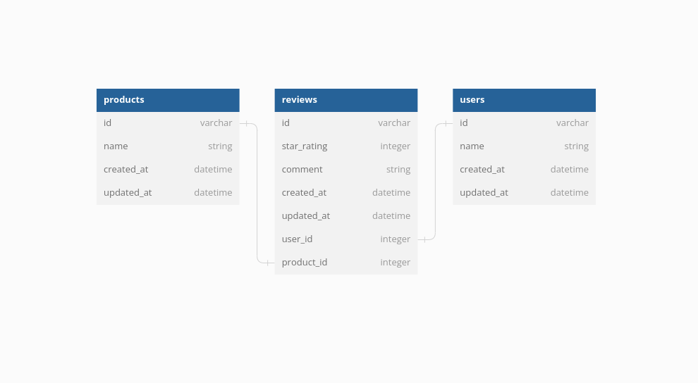

# Skinopatra
## Introduction
Welcome to Skinopatra, a skincare brand that has cautiously created idea of conveying nature to your doorstep.We trust that nobody ought to need to trade off their wellbeing for beauty.

The project is an e-commerce domain focusing on products and product reviews. We have three models: User, Review, and Product. A Product has many Users, a User has many Products’ s, and a Review belongs to a User and to a Product.

Product - User is a many to many relationship.

## Goals
* Use Active Record to interact with a database.
* Have a minimum of two models with a one-to-many relationship.
* Create API routes in Sinatra that handles at least three different CRUD actions for at least one of your Active Record models.
* Build a separate React frontend application that interacts with the API to perform CRUD actions. 

## Technologies used
1. Ruby
2. Sinatra
3. SQLite3

## Entity Relationship Diagram(ERD)

### Migrations
Created a migration for the products, users and reviews table.

A product has many users and many reviews through users. A user has many reviews and many products through reviews.

A Review belongs to a Product, and a Review also belongs to a User. In the migration, created user id column and product id column in reviews table to establish these relationships.
The reviews table should also have:
A star_rating column that stores an integer.
A comment column that stores a string.

### Object Association Methods
Used Active Record association macros and Active Record query methods (i.e. has_many, has_many through, and belongs_to).

1. Review
* Review#user
  Returns the User instance for this Review
* Review#product
  Returns the Product instance for this Review
2. Product
* Product#reviews
  Returns a collection of all the Reviews for the Product
* Product#users
  Returns a collection of all the Users who reviewed the Product
3. User
* User#reviews
  Returns a collection of all the Reviews that the User has given
* User#products
  Returns a collection of all the Products that the User has reviewed

## Endpoints
React app linked to backend using server running on port http://localhost:9292 to retrieve the product data and app to be deployed later on Netlify and railway.

## Core Deliverables 
A user should be able to:
 * See images of all products rendered in product collection from the database
 * add an Item to the list of products,functionality to be restricted to the admin side
 * search for product categories 
 * delete an Item from the list of products
 * update item details 

## Author & License
Linet Oliech is the sole contributor to this project. Project is licensed and author does not grant permissions for Commercial use, Reproduction, Distribution, Modification, Patent and Private use.Copyright (c) 2023 Linet Oliech

## Contact Information
For any queries or enquiries feel free to reach out at oliechlin@gmail.com
